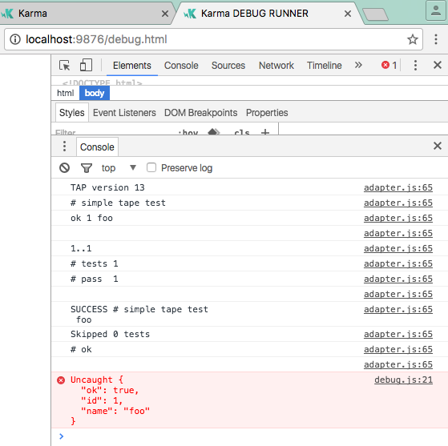

# testing karma rollup tape

```bash
npm install
npm run build # browserify tape to build/tape.js 
npm test # run karma
```

### Current issue:

- seems as the tests run successfully in the browser but are not reported back to karma, see screenshot:


### related
- rollup can not bundle tape https://github.com/rollup/rollup/issues/1072
